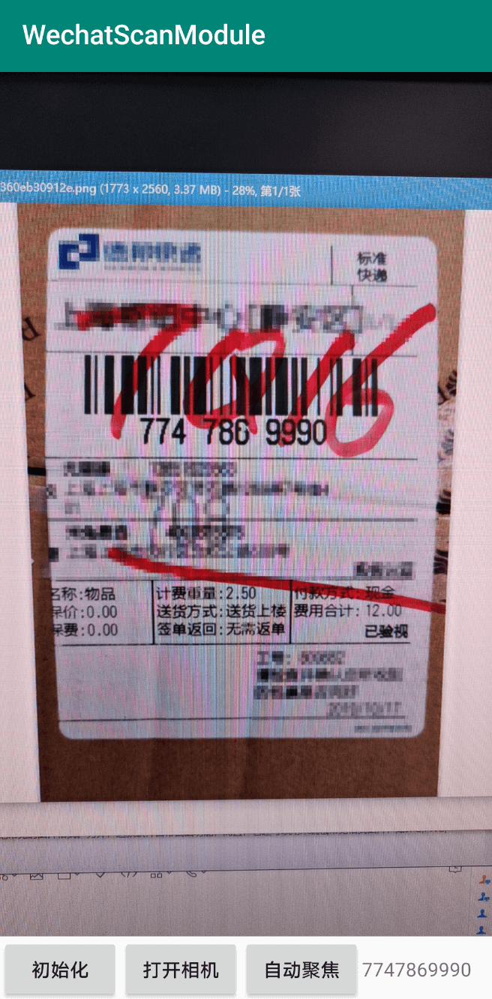

# 微信扫一扫模块

## 前言（免责声明）

本文章仅用于安全学习、安全研究、技术交流，请勿恶意利用。

请遵守相关法律，禁止非法用途！任何非法用途与作者无关，后果自负！

## 说明

反汇编 [微信7.0.8.1540](https://www.wandoujia.com/apps/596157/history_v1540) 版本，提取扫一扫功能模块。

如若没有重大变动，本工程基本不会更新，但会持续关注。

### 温馨提示

如果出现`dalvik.system.PathClassLoader`的问题，基本是Android Studio没有将相关Jni打包进APK，使用命令行调试软件

```bash
# Windows
gradlew.bat installDebug
# Linux
./gradlew installDebug
```

### 截图



## 使用

### 总体概述

在适当的位置声明一个[WechatScanner](./library/src/main/java/com/tencent/qbar/WechatScanner.kt)对象，如若不清楚可参照[MainActivity](./app/src/main/java/com/tencent/qbar/sample/MainActivity.kt)中进行编写，本库的总体方法调用顺序如下，请严格按照本顺序进行调用：

1. library.releaseAssert
2. library.init
3. library.setReader
4. library.onPreviewFrame
5. library.release

> app中没有增加动态申请权限，运行时请到设置手动给予权限。

### 引用

首先增加私有仓库的引用地址，在项目对应的 build.gradle 文件中增加私有仓库地址。

如若不清楚，请参照：[build.gradle](./app/build.gradle) 进行对应的配置

```groovy
// 引入私有仓库地址
repositories {
	maven { url 'https://jitpack.io' }
}
// 引入本项目的包文件
dependencies {
	implementation "com.github.sollyu:wechat-scanner:1.1.1"
}
```

### 复制so

将[so文件]()复制到项目的JniLibs目录下，<font color=red>aar不会复制so文件</font>。


### 方法介绍

#### [releaseAssert](./library/src/main/java/com/tencent/qbar/WechatScanner.kt#L34)

```kotlin
/**
 * 释放扫码必备的资源文件
 *
 * 主要释放Assert下对qbar文件到 /data/data/package/files/qbar 下
 *
 * @param context 上下文
 * @param folder  输出到文件夹名称 默认：qbar
 *
 * @throws IOException 可能文件权限有问题
 */
@Throws(IOException::class)
fun releaseAssert(context: Context, folder: String = "qbar")
```

#### [init](./library/src/main/java/com/tencent/qbar/WechatScanner.kt#L59)

```kotlin
/**
 * 初始化扫一扫模块
 *
 * 在初始化一定要释放扫码资：releaseAssert
 *
 * @param folder 释放文件的文件夹
 *
 * @see releaseAssert
 * @see release
 *
 * @throws IOException 找不到初始化的各项资源
 */
@Throws(IOException::class)
fun init(context: Context, folder: String = "qbar"): Int
fun init(folder: File): Int
```

#### [setReader](./library/src/main/java/com/tencent/qbar/WechatScanner.kt#L107)

```kotlin
/**
 * 设置解码器
 *
 * @param intArray 解码支持参数
 *                 具体数值暂时不清楚
 *                 请固定填写: 2, 1
 *
 * @return 0 => 成功
 */
fun setReader(intArray: IntArray = intArrayOf(2, 1)): Int
```

#### [version](./library/src/main/java/com/tencent/qbar/WechatScanner.kt#L115)

```kotlin
/**
 * 当前扫一扫版本信息
 *
 * @return 3.2.20190712
 */
fun version(): String
```

#### [onPreviewFrame](./library/src/main/java/com/tencent/qbar/WechatScanner.kt#L127)

```kotlin
/**
 * 相机预览的数据
 *
 * @param data      相机数据
 * @param size      data对应的图片大小
 * @param crop      裁剪的图片大小
 * @param rotation  旋转图片角度
 *
 * @return 扫描完成的List
 */
fun onPreviewFrame(data: ByteArray, size: Point, crop: Rect, rotation: Int): List<QbarNative.QBarResultJNI>
```

#### [release](./library/src/main/java/com/tencent/qbar/WechatScanner.kt#L151)

```kotlin
/**
 * 释放相关资源
 */
fun release(): Int
```

### 结构体介绍

#### [QbarNative.QBarResultJNI](./library/src/main/java/com/tencent/qbar/QbarNative.java#L39)

```java
/**
 * 扫一扫返回数组
 */
public static class QBarResultJNI {

    /**
     * 字符集合
     *
     * @see java.nio.charset.Charset
     */
    public String charset;

    /**
     * 字符集合的内容，常见格式：UTF-8、ASCII、ISO8859-1
     * 一般使用 new String(data, charset) 可解出数据
     *
     * @see String
     * @see java.nio.charset.Charset
     */
    public byte[] data;

    /**
     * 未知含义
     */
    public int typeID;

    /**
     * 当前扫出来二维码类型
     * 一般有：CODE_25、CODE_39、CODE_128、QR_CODE、
     */
    public String typeName;
}
```

#### [QbarNative.QbarAiModelParam](./library/src/main/java/com/tencent/qbar/QbarNative.java#L29)

```java
/**
 * 扫一扫模块初始化参数
 * 参数暂时不明确含义
 */
public static class QbarAiModelParam {
    public String detect_model_bin_path_;
    public String detect_model_param_path_;
    public String superresolution_model_bin_path_;
    public String superresolution_model_param_path_;
}
```

## 其他说明

本工程采用标准的[Git Flow](https://www.git-tower.com/learn/git/ebook/cn/command-line/advanced-topics/git-flow)进行版本维护，提交日志信息请参照[Git Moji](https://gitmoji.carloscuesta.me/)。


## LICENSE

```
                   GNU LESSER GENERAL PUBLIC LICENSE
                       Version 3, 29 June 2007

 Copyright (C) 2007 Free Software Foundation, Inc. <http://fsf.org/>
 Everyone is permitted to copy and distribute verbatim copies
 of this license document, but changing it is not allowed.
```
